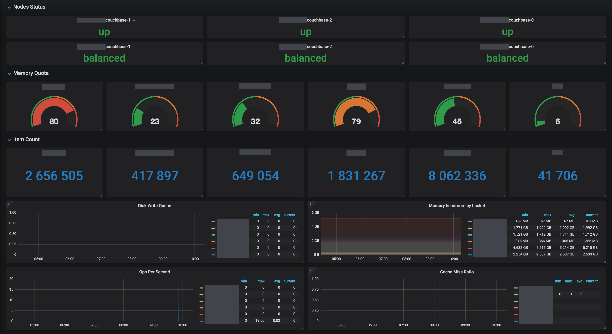

# Couchbase Exporter

[](https://travis-ci.org/blakelead/couchbase_exporter)
[](https://coveralls.io/github/blakelead/couchbase_exporter?branch=master)
[](/LICENSE.txt)

Expose metrics from Couchbase cluster for consumption by Prometheus.

## Getting Started

Run from command-line:

```bash
./couchbase_exporter [flags]
```

The exporter supports various configuration ways: command-line arguments takes precedence over environment variables that take precedence over configuration file.

Configuration file can be provided on the command line. It must be written in json or yaml. If none is provided using the command line `--config.file` option, it will look for a file named `config.json` or `config.yml` in the same directory that the exporter binary. You can find complete examples of configuation files in the sources (directory `examples`).

As for available flags and equivalent environment variables, here is a list:

|    environment variable    |      argument       |              description               |        default        |
| -------------------------- | ------------------- | -------------------------------------- | --------------------- |
|                            | -config.file        | Configuration file to load data from   |                       |
| CB_EXPORTER_LISTEN_ADDR    | -web.listen-address | Address to listen on for HTTP requests | :9191                 |
| CB_EXPORTER_TELEMETRY_PATH | -web.telemetry-path | Path under which to expose metrics     | /metrics              |
| CB_EXPORTER_SERVER_TIMEOUT | -web.timeout        | Server read timeout in seconds         | 10s                   |
| CB_EXPORTER_DB_URI         | -db.uri             | Address of Couchbase cluster           | https://127.0.0.1:18091 |
| CB_EXPORTER_DB_TIMEOUT     | -db.timeout         | Couchbase client timeout in seconds    | 10s                   |
| CB_EXPORTER_DB_USER        | *not allowed*       | Administrator username                 |                       |
| CB_EXPORTER_DB_PASSWORD    | *not allowed*       | Administrator password                 |                       |
| CB_EXPORTER_LOG_LEVEL      | -log.level          | Log level: info,debug,warn,error,fatal | error                 |
| CB_EXPORTER_LOG_FORMAT     | -log.format         | Log format: text, json                 | text                  |
| CB_EXPORTER_SCRAPE_CLUSTER | -scrape.cluster     | If false, wont scrape cluster metrics  | true                  |
| CB_EXPORTER_SCRAPE_NODE    | -scrape.node        | If false, wont scrape node metrics     | true                  |
| CB_EXPORTER_SCRAPE_BUCKET  | -scrape.bucket      | If false, wont scrape bucket metrics   | true                  |
| CB_EXPORTER_SCRAPE_XDCR    | -scrape.xdcr        | If false, wont scrape xdcr metrics     | false                 |
| CB_EXPORTER_TLS_SETTING    | -tls.setting        | If true, will ignore Self Signed Certs | false                 |
|                            | -help               | Command line help                      |                       |

> Important: for security reasons credentials cannot be set with command line arguments.

## Metrics

All metrics are listed in [resources/metrics.md](resources/metrics.md).

## Docker

Use it like this:

```bash
docker run --name cbexporter -p 9191:9191 -e CB_EXPORTER_DB_USER=admin -e CB_EXPORTER_DB_PASSWORD=complicatedpassword blakelead/couchbase-exporter:latest
```

## Examples

You can find example files in `resources` directory.

### Prometheus

Some simple alerting rules: [resources/prometheus-alerts.yaml](resources/prometheus-alerts.yaml).

### Grafana

Minimal dashboard ([resources/grafana-dashboard.json](resources/grafana-dashboard.json)):

<p align="center"></p>

### Systemd

You can adapt and use the provided service template to run the exporter with systemd ([resources/couchbase-exporter.service](resources/couchbase-exporter.service)):

```bash
sudo mv couchbase-exporter.service /etc/systemd/system/couchbase-exporter.service
sudo systemctl enable couchbase-exporter.service
sudo systemctl start couchbase-exporter.service
```

## Contributors

A special thanks to:

- @Berchiche
- @bitdba88 (Don Thomson)
